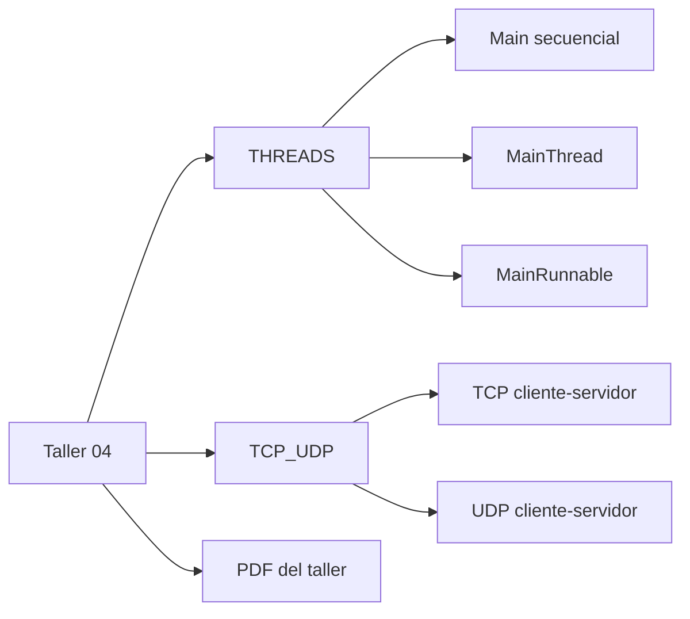
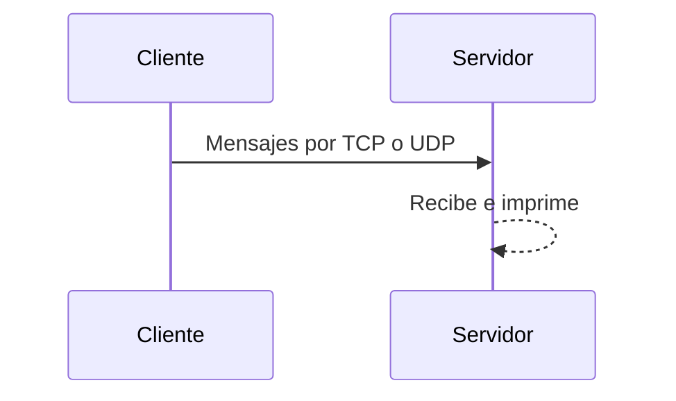

# Taller 04

Repo de ejercicios de **Sistemas Distribuidos** en Java orientado al análisis práctico de dos temas base del curso. Por un lado, incluye ejemplos de comunicación **cliente-servidor** con sockets para comparar el comportamiento de **TCP** y **UDP**, observando cómo se envían y reciben mensajes, qué puertos utiliza cada implementación y cuáles son sus diferencias generales en conexión, confiabilidad y simplicidad. Por otro lado, incluye una simulación de atención en supermercado para comparar una ejecución **secuencial** frente a una **concurrente** en Java, usando clases como `Cliente`, `Cajera`, `Main`, `MainRunnable` y `CajeraThread`, con el fin de ver cómo cambia el tiempo total de procesamiento cuando varias tareas avanzan al mismo tiempo.

## Contenido

```text
Taller04/
├── THREADS/      # secuencial vs Thread vs Runnable
├── TCP_UDP/      # cliente/servidor por TCP y UDP
└── Taller04-1.pdf
```

## Vista rápida





## Qué muestra cada carpeta

- `THREADS/`: simulación de cajeras y clientes para comparar procesamiento secuencial y concurrente.
- `TCP_UDP/`: ejemplos básicos de cliente-servidor usando sockets TCP y UDP.
- `Taller04-1.pdf`: enunciado o soporte del taller.

## ¿Cómo ejecutar?

```bash
cd THREADS
make All
make secuencial
make thread
make runnable
```

```bash
cd TCP_UDP
make All
make run-tcp-server
make run-tcp-client ARGS=localhost
make run-udp-server
make run-udp-client ARGS=localhost
```
