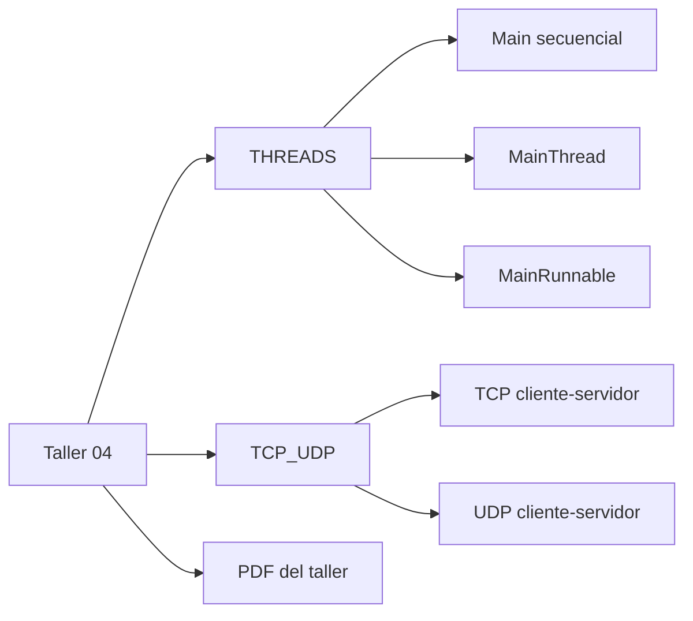
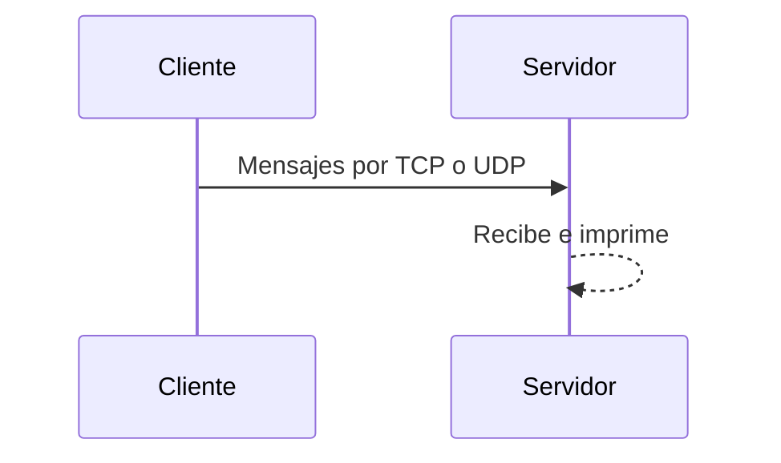

# Taller 04

Repo de ejercicios de **Sistemas Distribuidos** en Java sobre **hilos** y **comunicación por sockets TCP/UDP**. El taller analiza dos ejes: la diferencia entre **TCP y UDP** en un esquema cliente-servidor, y la diferencia entre **ejecución secuencial y concurrente** en Java mediante una simulación de cajeras, clientes y tiempos de procesamiento.

## Contenido

```text
Taller04/
├── THREADS/      # secuencial vs Thread vs Runnable
├── TCP_UDP/      # cliente/servidor por TCP y UDP
└── Taller04-1.pdf
```

## Vista rápida





## Qué muestra cada carpeta

- `THREADS/`: simulación de cajeras y clientes para comparar procesamiento secuencial y concurrente.
- `TCP_UDP/`: ejemplos básicos de cliente-servidor usando sockets TCP y UDP.
- `Taller04-1.pdf`: enunciado o soporte del taller.

## ¿Cómo ejecutar?

```bash
cd THREADS
make All
make secuencial
make thread
make runnable
```

```bash
cd TCP_UDP
make All
make run-tcp-server
make run-tcp-client ARGS=localhost
make run-udp-server
make run-udp-client ARGS=localhost
```
